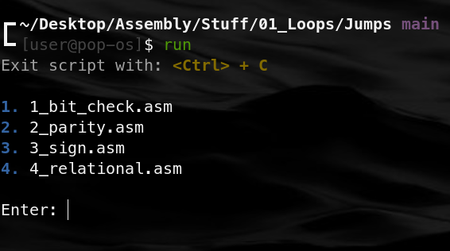

# nasm_script

 Assemble and link either one or multiple .asm files. With your choice of executing or debugging your program

## How to get Started

- Clone the repository into your working directory with this command

  ```
  git clone https://github.com/thecodeofdaniel/nasm_script.git <~/SOME/PATH>
  ```

- Create a file named `lib_dir.txt`.

  ```
  touch lib_dir.txt
  ```

- Inside that file declare the location of your library directory. Such as...

  ```
  /home/user/Desktop/Assembly/Library/
  ```

- Create an alias for the script. Either declare it the terminal or in your `.bashrc` file. The alias can be whatever name you want. I'm going with **run**.

  ```
  alias run="bash <~/PATH/TO/WHERE/YOU/CLONED/REPO>"
  ```

- Now you can run this file anywhere you want!

<br />

## Guide

- When you run the script you will be prompted with...

- 

- You can enter something like this

  ```
  Enter: e 1 2
  or
  Enter: d 1 2
  ```

### Explanation

- `e` = execute

- `d` = debug

- `1` = the first file listed in prompt

- `2` = the second file listed in prompt

<br />

- The order in which you put the files does not matter, so I could've instead put

  ```
  Enter: e 2 1
  ```

- However, your first character should always be: `e` or `d`

### Shortcut

- Entering a command with no selected files from the list will assume that you want all files within the current directory to be executed or debugged

  ```
  Enter: e
  ```

- is the same as (if we use the example above)

  ```
  Enter: e 1 2 3 4
  ```

- The same goes for debugging: `d`

<br />

## Other Commands

- `c` = clear screen

- `<up|down arrow key>` = go through input history

- `<empty>` = execute/debug the last acceptable command of that session

<br />

## Video Examples:

https://user-images.githubusercontent.com/100104016/179667430-df1aba73-e104-45bd-bc34-298978a0c0c9.mp4
